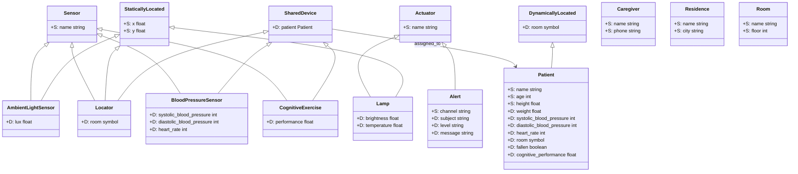

# ERMES Classes

This folder defines the domain classes used by ERMES as JSON class descriptors.
Each file describes a class name, optional parent classes, and static/dynamic
properties with type and constraint metadata.

Legend: `S:` = static property, `D:` = dynamic property.

