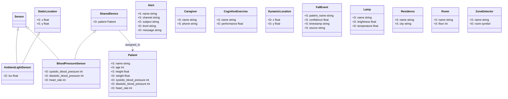

# ERMES Classes

This folder defines the domain classes used by ERMES as JSON class descriptors.
Each file describes a class name, optional parent classes, and static/dynamic
properties with type and constraint metadata.

## Class Overview

### `Alert`
- Purpose: generic notification entity.
- Static properties: `name`, `channel`.
- Dynamic properties: `subject`, `level`, `message`.

### `AmbientLightSensor`
- Purpose: measures ambient light.
- Inherits from: `Sensor`, `StaticLocation`.
- Dynamic properties: `lux` (float, min 0).

### `BloodPressureSensor`
- Purpose: shared sensor device for blood pressure and heart rate readings.
- Inherits from: `Sensor`, `SharedDevice`.
- Dynamic properties:
	- `systolic_blood_pressure` (int, 0..300)
	- `diastolic_blood_pressure` (int, 0..200)
	- `heart_rate` (int, 0..300)

### `Caregiver`
- Purpose: caregiver contact information.
- Static properties: `name`, `phone`.

### `CognitiveExercise`
- Purpose: cognitive training activity.
- Static properties: `name`.
- Dynamic properties: `performance` (float, 0..1).

### `DynamicLocation`
- Purpose: dynamic 2D position.
- Dynamic properties: `x`, `y`.

### `FallEvent`
- Purpose: detected fall record with confidence and source metadata.
- Static properties: `patient_name`, `confidence`, `timestamp`, `source`.

### `Lamp`
- Purpose: smart lighting device state.
- Static properties: `name`.
- Dynamic properties: `brightness` (float, 0..1), `temperature` (float, 0..1).

### `Patient`
- Purpose: patient profile and physiological state.
- Static properties: `name`, `age`, `height`.
- Dynamic properties: `weight`, `systolic_blood_pressure`,
	`diastolic_blood_pressure`, `heart_rate`.

### `Residence`
- Purpose: residence metadata.
- Static properties: `name`, `city`.

### `Room`
- Purpose: room metadata.
- Static properties: `name`, `floor`.

### `Sensor`
- Purpose: base marker class for sensor entities.

### `SharedDevice`
- Purpose: device assigned to a patient.
- Dynamic properties: `patient` (object of class `Patient`).

### `StaticLocation`
- Purpose: fixed 2D location.
- Static properties: `x`, `y`.

### `ZoneDetector`
- Purpose: detector reporting the current room zone.
- Static properties: `name`.
- Dynamic properties: `room` (symbol: `living_room`, `kitchen`, `bedroom`,
	`bathroom`).

## Mermaid Class Diagram

Yes, you can use Mermaid for the class diagram. A ready-to-render example:

Legend: `S:` = static property, `D:` = dynamic property.

